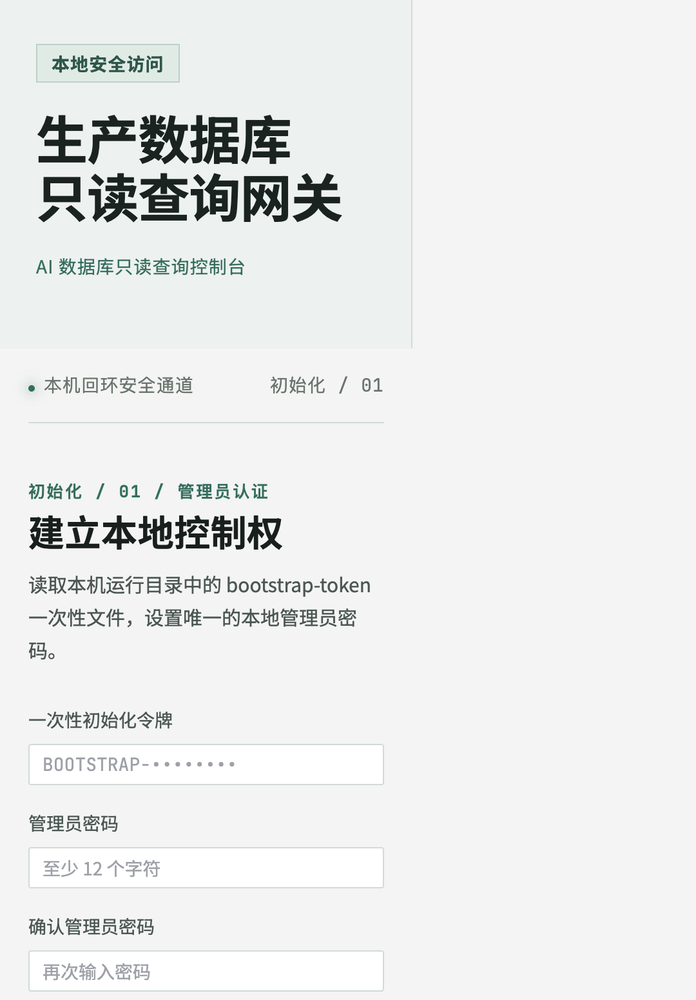

# AI 数据库查询网关

[](https://openjdk.org/)
[](https://vuejs.org/)
[](LICENSE)

[English](README.md)

这是一个本地优先、带审计能力的数据库查询网关，用于让 AI 客户端受控查询 MySQL 和
OceanBase。管理员在网页中维护数据源，REST API 统一执行查询策略，本地 MCP STDIO
适配器只向 Codex、Claude 或其他本地 AI 客户端暴露固定的查询工具。

当前版本面向单台 macOS 电脑，解决“每次 AI 会话都要粘贴数据库地址、账号和密码”的问题，
把凭据、查询策略、审批和审计收敛到本机边界内。



## 功能概览

- 支持 MySQL、OceanBase MySQL 模式和 OceanBase Oracle 模式，并通过连接器 SPI 预留扩展点。
- 数据库凭据和审计加密密钥保存在 macOS Keychain；SQLite 保存元数据、作用域和审计链，
  不保存明文凭据。
- 网页端管理数据源、审批、作用域令牌和审计轨迹。
- MCP 只提供八个固定工具：列出数据源、查看 Schema/表、查看表结构、执行查询、查看查询
  请求、执行已批准查询和取消查询。
- AI 客户端拿不到 JDBC URL、主机、用户名、密码、Keychain 引用、令牌管理或审计管理能力。
- 在获取业务库连接前使用 AST 执行 SQL 策略，只允许单条 `SELECT`、`UNION` 或最终为查询的
  非递归 CTE。
- 拒绝写操作、DDL、事务和会话控制、注释与 Hint、多语句、锁、文件操作、数据库链接、
  递归 CTE 和未支持函数。
- 固定行数、响应大小、字段大小、超时、并发和令牌速率，支持一次性审批、取消和回滚。
- 查询结果只存在于当前请求，不写入 SQLite、审计、普通日志，也不提供 CSV/Excel 导出。

## 只读边界

网关有意不检查数据库账号权限。连接成功的数据源会标记为 `COMPATIBILITY`，每条查询都
必须经过网关的只读执行链。这属于应用层控制，不等同于数据库权限层面的绝对只读。连接
生产库时仍建议使用只授予必要 `SELECT` 权限的数据库账号。

## 架构

```text
网页控制台 ── Session + CSRF ──┐
                              v
AI 客户端 ── STDIO ── MCP ──令牌──> Spring Boot 网关
                                  │
                                  ├─ 登录认证和令牌作用域
                                  ├─ SQL AST 策略和风险审批
                                  ├─ SQLite 控制面与链式 HMAC 审计
                                  ├─ macOS Keychain 凭据引用
                                  └─ 有界 JDBC 连接池 ──> MySQL / OceanBase
```

服务默认监听 `127.0.0.1:8765`，不是数据库 TCP 代理，也不提供远程 HTTP MCP。非回环监听
必须显式开启远程模式并配置 Spring TLS。

## 环境要求

- 可访问 Keychain 的 macOS
- Java 21
- Xcode Command Line Tools（编译 Swift Keychain helper）
- Docker Desktop（可选，用于 MySQL 集成测试）
- 首次构建时可访问 Maven Central、Node.js 和 npm registry

构建会把固定版本的 Node `22.14.0` 和 npm `10.9.2` 下载到工程的忽略目录，不要求系统预装
Node。

## 快速开始

```bash
git clone https://github.com/tangguo95/ai-db-query-gateway.git
cd ai-db-query-gateway
./scripts/build.sh
./scripts/run.sh
```

打开 <http://127.0.0.1:8765>。第一次启动时，服务会创建一次性文件：

```text
~/Library/Application Support/AI DB Query Gateway/bootstrap-token
```

只在本机读取该文件，将令牌输入初始化页面并设置本地管理员密码。初始化成功后文件会删除，
密码只保存为 Argon2id 摘要。

默认运行目录为：

```text
~/Library/Application Support/AI DB Query Gateway/
```

其中包含 SQLite 控制库和初始化状态。数据库凭据与审计密钥独立保存在 Keychain，不会进入
仓库、进程参数、环境变量或普通日志。

## 使用 MCP 连接 AI

1. 在网页中新增并测试数据源。
2. 创建短期令牌，只勾选客户端需要的数据源，并确认结果可能发送给 AI 的提示。
3. 在终端把令牌保存到本机 Keychain：

   ```bash
   ./scripts/configure-mcp-token.sh
   ```

4. 启动 MCP 适配器：

   ```bash
   ./scripts/run-mcp.sh
   ```

如果客户端自行管理 MCP 子进程，可使用生成的 JAR，并把令牌放在客户端私有配置中：

```json
{
  "command": "java",
  "args": ["-jar", "/absolute/path/to/gateway-mcp/target/gateway-mcp.jar"],
  "env": {
    "AI_DB_GATEWAY_URL": "http://127.0.0.1:8765",
    "AI_DB_GATEWAY_TOKEN": "<作用域令牌>"
  }
}
```

不要把该配置提交到仓库，也不要把有效令牌粘贴到 Issue、聊天、命令行参数或 README。网页只
显示一次令牌；之后可以直接调整令牌的数据源范围，不需要重新生成令牌或重新配置 MCP。

## 常见查询方式

可以让 AI 先列出数据源，再查看目标 Schema/表结构，然后执行带参数的 `SELECT`，同时说明
查询用途和行数上限。例如：

```text
使用“订单查询库”，先查看 order_info 的字段；然后按订单号 ? 查询该订单的状态，
用途是核对工单 123，最多返回 20 行。不要执行任何写操作。
```

系统 Schema、跨 Schema、超过三个表、`SELECT *` 或超过 200 行等风险请求会进入待审批状态，
需要在网页中批准后才能一次性执行。

## 限制与安全说明

默认允许 200 行，硬上限 1,000 行；SQL 上限 32 KiB，响应上限 5 MiB，单字段上限 256 KiB；
数据源超时 5–30 秒；每个数据源最多并发 2 条、全局最多 4 条；每个令牌每分钟最多 30 次。
这些是服务端限制，客户端不能提高。

连接生产库前请阅读 [SECURITY.md](SECURITY.md)，其中说明了同一 macOS 用户的 Shell 边界、
本地链式 HMAC 审计的能力范围、取消语义、TLS 选择，以及 AI 服务商可能接收到原始查询结果的
风险。

## 工程结构

```text
gateway-server/          Spring Boot API、策略、JDBC 执行、审计和静态资源托管
gateway-mcp/              不包含数据库驱动的 MCP 2024-11-05 STDIO 适配器
frontend/                 Vue 3 + TypeScript 网页控制台
native/macos-keychain/    Swift Security.framework helper
docs/                     REST、MCP、架构和测试文档
scripts/                  可复现构建、启动和令牌配置脚本
```

## 开发与验证

```bash
./mvnw clean verify
```

该命令会运行 Java、MCP 和前端测试，执行 Vue 类型检查和生产构建，并打包两个 JAR。Docker
可用时会运行 MySQL 测试；OceanBase 驱动兼容性应先在非生产租户验证。

更多信息请查看 [docs/testing.md](docs/testing.md)、[docs/api.md](docs/api.md)、
[docs/mcp.md](docs/mcp.md) 和 [docs/architecture.md](docs/architecture.md)。

## 贡献

请保持本项目本地优先并默认拒绝：不要向 AI 响应添加凭据字段，不要记录 SQL 或参数，策略变更
必须增加回归测试。只使用本地或容器测试库，禁止使用生产凭据。漏洞报告方式见 [SECURITY.md](SECURITY.md)。

## AI 辅助开发

可以使用 AI 工具提出代码或文档建议，但每项变更都必须经过人工审查、本地测试，并检查凭据泄露
和 SQL 策略回归后再合并。

## 许可证

本项目采用 [MIT License](LICENSE) 开源。

## 联系方式

可通过 Issue 提交可复现的 Bug 或功能建议。安全问题请按照 [SECURITY.md](SECURITY.md) 的私下
报告说明处理。项目主页：<https://github.com/tangguo95>。
